<div align="center">

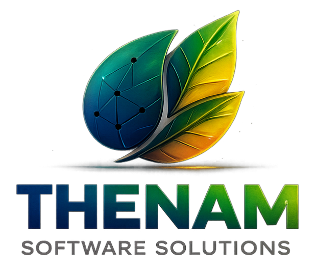

# Thenam Software Solutions

### *Engineering Intelligent Digital Ecosystems*

An AI-first product studio building premium software, automation<br/>and intelligent digital ecosystems for ambitious teams.

---

[](https://thenamsoftwaresolutions.com)
[](https://www.linkedin.com/company/thenam-software-solutions/)
[](https://github.com/Thenamsoftwaresolutions)
[](https://wa.me/916380456410)
[](mailto:admin@thensoftwaresolutions.com)

---


</div>

---

<div align="center">

<a href="https://thenamsoftwaresolutions.com">
  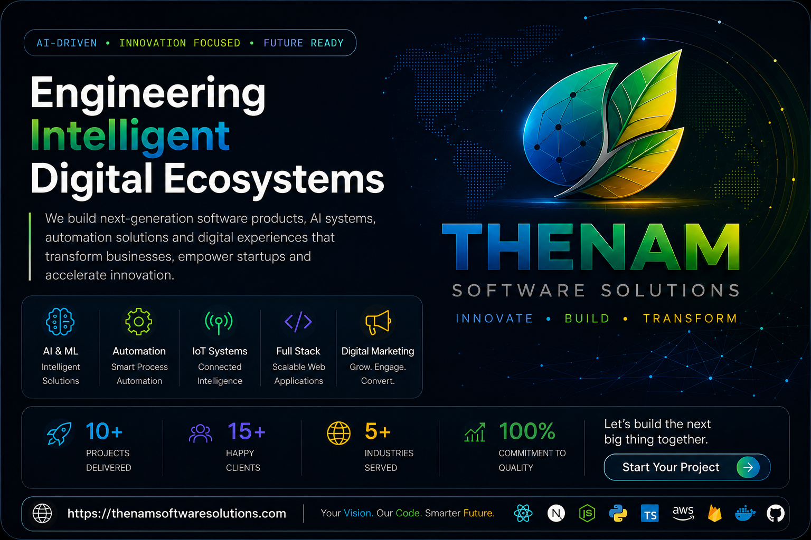
</a>

</div>

---

## 🏢 About Us

**Thenam Software Solutions** is a next-generation **AI-first product studio** founded in **2025** in **Chennai, India**. We design and ship software, automation, and IoT systems for ambitious teams worldwide. We build category-defining products and intelligent ecosystems that define the next generation of their industries.

> *"Software is becoming intelligent, ambient and deeply personal. The teams that ship the next decade of products will be those that combine taste, engineering and AI fluency. We built Thenam to be one of them."*

### 🎯 Our Operating Principles

| Principle | Philosophy |
|:---:|:---|
| ✨ **Craft** | The work is the brand. Every pixel, every API, every interaction. |
| 🔍 **Clarity** | Calm design. Honest writing. Clear pricing. Clear contracts. |
| 📈 **Compounding** | We build platforms, not projects. Leverage compounds when the system is clean. |
| 🔬 **Curiosity** | Research is not a phase. It's how we work, every week. |
| 💙 **Care** | For users, for each other, for the long arc of the work. |
| 🦁 **Courage** | We take the harder, better path — and ship it. |

### 📊 Studio Snapshot

| Founded | Headquarters | Team | Practices | Industries | Approach |
|:---:|:---:|:---:|:---:|:---:|:---:|
| **2025** | **Chennai, India** | Engineers · Designers · Researchers | AI · Product · Design · Platform | Commerce · Media · Health · IoT · Public | Small teams · Real ownership · Elite craft |

---

## 🛠️ Our Services

> **14 disciplines. One intelligent operating system.** — An end-to-end studio for applied AI, product engineering, growth, and industrial automation.

### 🧠 Intelligence Layer

<div align="center">
  
</div>

| # | Service | Description | Key Capabilities | Metrics |
|:---:|:---|:---|:---|:---|
| 01 | **🤖 AI Development** | Agents, copilots and predictive systems built for production | LLM Apps · Agentic Workflows · RAG & Vector Search · Fine-tuning & Evals | `98.4%` eval accuracy · `42ms` first token · `10×` faster iteration |
| 02 | **🧩 Agentic AI Solutions** | Autonomous multi-agent systems that take real action | Multi-agent Orchestration · Tool Use & Function Calling · Long-horizon Planning · Agent Memory | `24×7` autonomous ops · `70%` workload offload |
| 03 | **👁️ Computer Vision** | Visual intelligence for inspection, counting and classification | Object Detection · Image Segmentation · OCR · Video Analytics | Real-time processing · Edge-optimized |

### ⚙️ Engineering Layer

<div align="center">
  
</div>

| # | Service | Description | Key Capabilities | Metrics |
|:---:|:---|:---|:---|:---|
| 04 | **💻 Full Stack Development** | Type-safe, edge-native apps with elite craft | Web Platforms · Mobile Apps · APIs & Microservices · Realtime Systems | `99.99%` uptime · `<120ms` p95 latency · `0` cold starts |
| 05 | **🏗️ Product Engineering** | Small teams that ship like a senior product org | Discovery Sprints · Rapid Prototyping · Product Analytics · Growth Instrumentation | `8 wk` MVP to live · `3.2×` activation lift |
| 06 | **☁️ SaaS Platforms** | Multi-tenant SaaS with billing, auth and elegant UX | Multi-tenancy · Auth & SSO · Billing & Metering · Admin & Ops Dashboards | SOC 2 ready · `12+` tenants live |

### 🔌 Edge & Hardware Layer

<div align="center">
  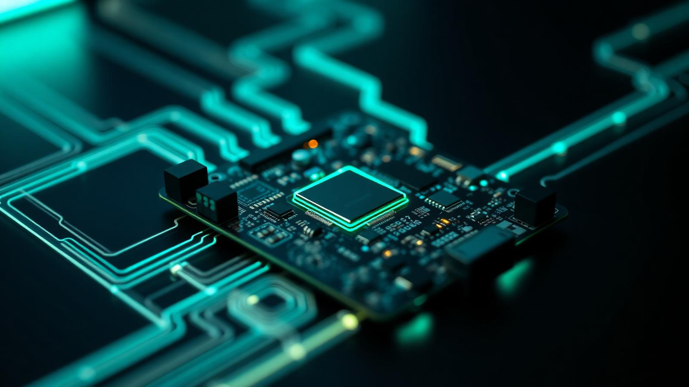
</div>

| # | Service | Description | Key Capabilities | Metrics |
|:---:|:---|:---|:---|:---|
| 07 | **📡 IoT Solutions** | Connected devices, edge AI and ambient intelligence | Sensor Design · Edge Inference · Gateway & MQTT · OTA Updates | `<50ms` edge inference · `28%` energy saved |
| 08 | **🔧 Hardware–Software Integration** | Embedded firmware and physical-digital product development | PCB Design · Sensor Fusion · Firmware Engineering · Digital Twin | End-to-end HW+SW delivery |
| 09 | **🤖 Robotics & ROS** | Autonomous systems with perception and navigation | ROS2 Integration · Navigation Stack · Perception Pipelines · SLAM | Industrial-grade reliability |


### 🎨 Design & Growth Layer

<div align="center">
  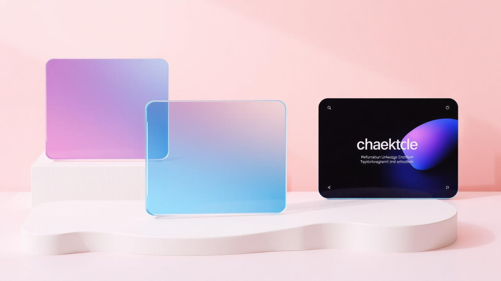
</div>

| # | Service | Description | Key Capabilities |
|:---:|:---|:---|:---|
| 10 | **🎨 UI/UX & Brand Design** | Cinematic interfaces, motion design, and brand systems | Design Systems · Motion Language · Brand Identity · User Research |
| 11 | **📈 Growth & SEO** | Performance marketing, conversion optimization, and growth strategy | Technical SEO · Conversion Optimization · Analytics Setup · Content Strategy |

### 🔬 Innovation & Ecosystem Layer

<div align="center">
  
</div>

| # | Service | Description | Key Capabilities |
|:---:|:---|:---|:---|
| 12 | **🧪 Innovation Lab** | Research-driven prototypes that become tomorrow's products | Vision AI · Agentic Research · Edge AI · Experimental Interfaces |
| 13 | **🎓 Student Ecosystem** | Building the next generation of builders | Fellowships · Hackathons · Residency Programs · Mentorship |

---

## 🏆 Featured Projects

> **Products we've shaped. Categories we're rewriting.** — A selection of case studies across AI, commerce, media, IoT and consumer software.

---

### 🛒 Zayamazone — *Premium E-commerce Platform*

<div align="center">
  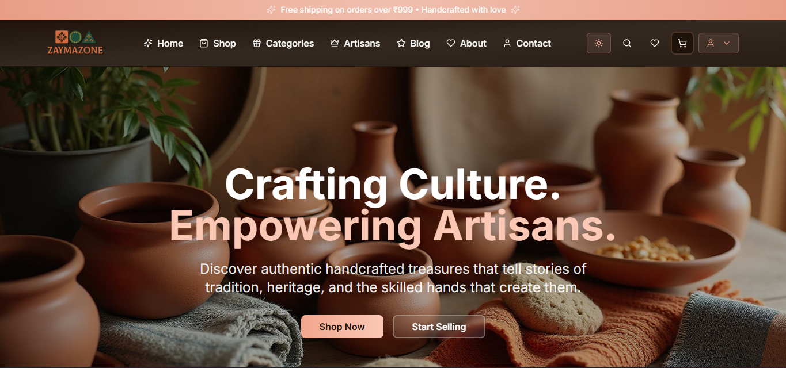
</div>

| Category | Type | Year | Key Results |
|:---:|:---:|:---:|:---|
| E-commerce | B2C | 2025 | `3.2×` conversion uplift · `42%` stockout reduction · `6×` merchant onboarding |

> Premium e-commerce platform engineered for scale — AI-powered recommendations, real-time inventory, and multi-vendor marketplace.

🔗 [View Case Study →](https://thenamsoftwaresolutions.com/projects/zayamazone)

---

### 🏠 RootnSpace — *Hostel & Residence Management*

<div align="center">
  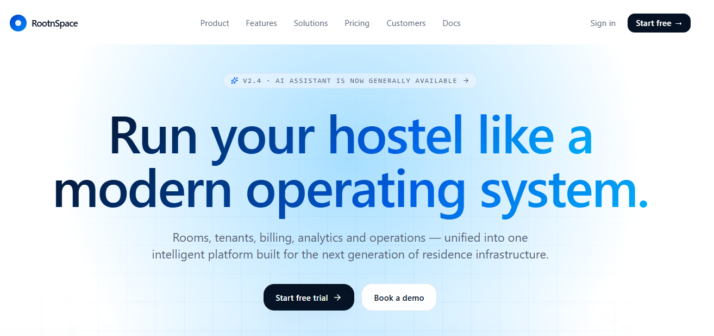
</div>

| Category | Type | Year | Key Results |
|:---:|:---:|:---:|:---|
| SaaS | B2B | 2025 | `80%` less admin time · `100%` billing accuracy · `12+` hostels live |

> Full-stack hostel management SaaS — tenant onboarding, automated billing, room allocation, and complaint tracking in one platform.

🔗 [View Case Study →](https://thenamsoftwaresolutions.com/projects/rootnspace)

---

### 🏡 Zara AI — *AI Home Automation*

<div align="center">
  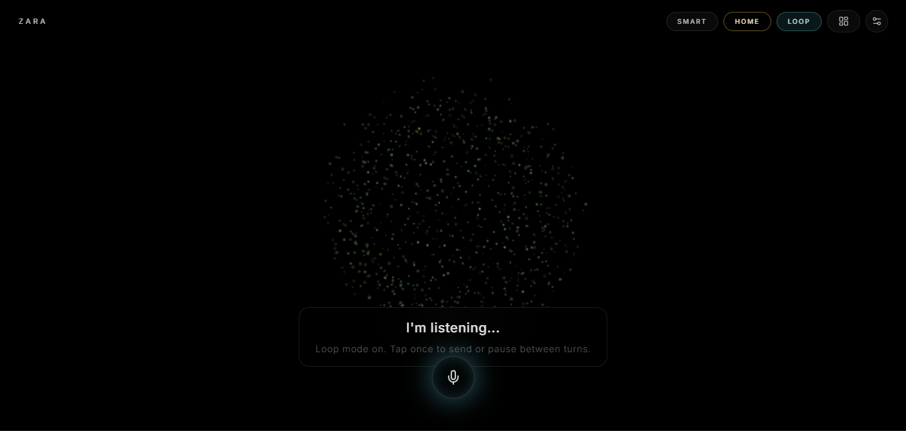
</div>

| Category | Type | Year | Key Results |
|:---:|:---:|:---:|:---|
| IoT / AI | Hardware + Software | 2025 | `<100ms` device response · `100+` devices supported · `24×7` edge uptime |

> AI home automation where hardware meets intelligent control — voice commands, scene automation, energy optimization, and edge-first architecture.

🔗 [View Case Study →](https://thenamsoftwaresolutions.com/projects/zara-ai)

---

### 🏙️ Chennai Tales — *Editorial Brand Platform*

<div align="center">
  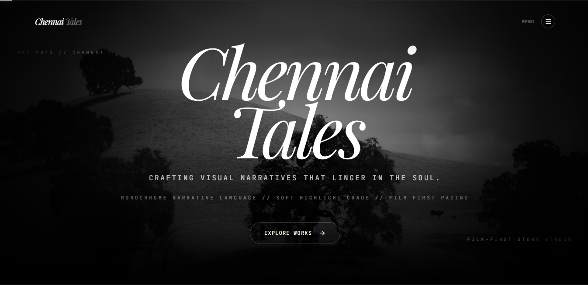
</div>

| Category | Type | Year | Key Results |
|:---:|:---:|:---:|:---|
| Brand | B2C | 2026 | `98` Lighthouse score · `6m+` avg session · `AA+` accessibility |

> Editorial brand platform celebrating Chennai's modern culture — cinematic visuals, immersive storytelling, and community-driven content.

🔗 [View Case Study →](https://thenamsoftwaresolutions.com/projects/chennai-tales)

---

### 👔 TT Dry Cleaning — *Booking & Operations Platform*

<div align="center">
  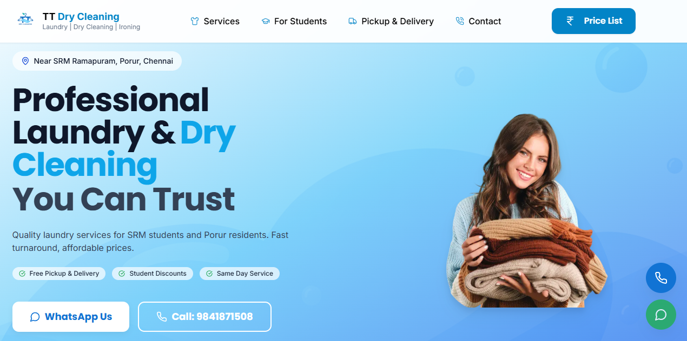
</div>

| Category | Type | Year | Key Results |
|:---:|:---:|:---:|:---|
| Business Automation | B2C | 2026 | `38%` faster turnaround · `4.9★` CSAT · `24×7` bookings |

> End-to-end booking and operations platform for a premium laundry brand — online scheduling, order tracking, and staff management.

🔗 [View Case Study →](https://thenamsoftwaresolutions.com/projects/tt-dry-cleaning)

---

### 🍽️ TastyLens — *AR-Powered Food Ordering*

<div align="center">
  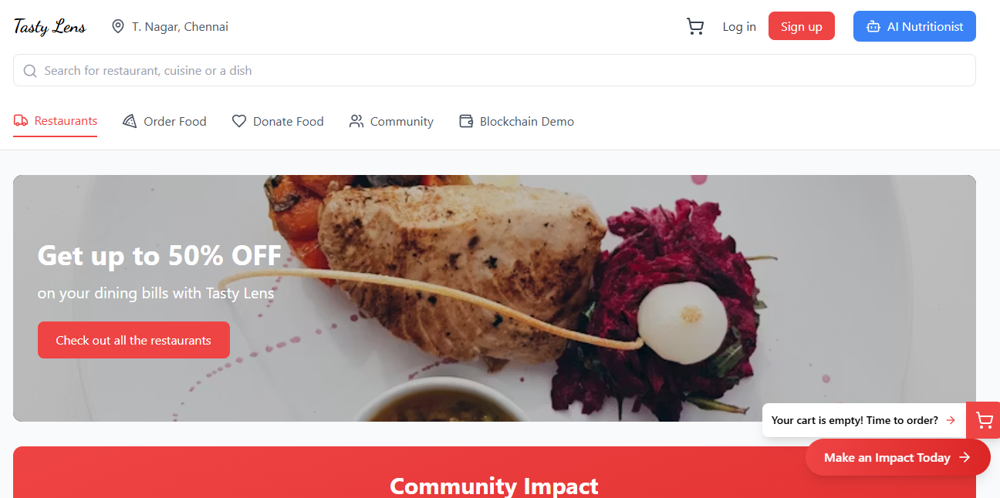
</div>

| Category | Type | Year | Key Results |
|:---:|:---:|:---:|:---|
| AR / VR | B2C | 2026 | AR preview mode · AI dietary assistance · Blockchain traceability |

> AR-powered food ordering with AI guidance and blockchain traceability — see your food in 3D before ordering, with allergen detection and supply chain transparency.

🔗 [View Case Study →](https://thenamsoftwaresolutions.com/projects/tastylens)

---

### 💰 FinEcho — *AI Personal Finance*

<div align="center">
  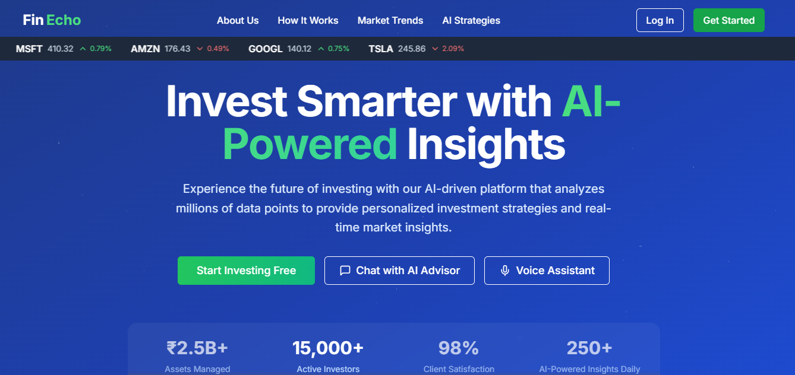
</div>

| Category | Type | Year | Key Results |
|:---:|:---:|:---:|:---|
| Finance | B2C | 2026 | Smart budgeting · AI insights · Expense automation |

> AI-powered personal finance management — intelligent budgeting, expense categorization, and predictive financial insights.

🔗 [View Case Study →](https://thenamsoftwaresolutions.com/projects/finecho)

---

### 🌾 AgriSmart — *Smart Agriculture IoT*

<div align="center">
  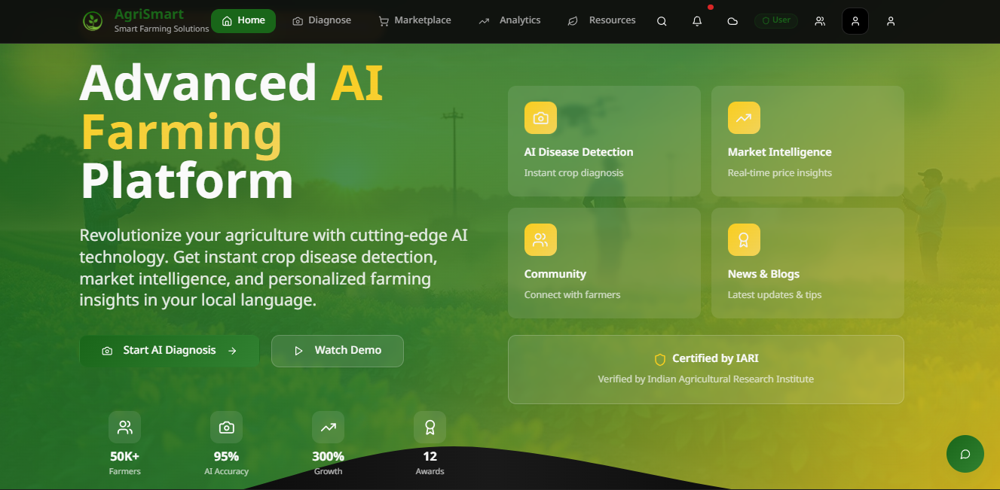
</div>

| Category | Type | Year | Key Results |
|:---:|:---:|:---:|:---|
| AgriTech / IoT | Hardware + Software | 2025 | IoT sensors · AI crop analytics · Automated irrigation |

> Smart agriculture platform — soil moisture sensors, weather integration, AI-powered crop health monitoring, and automated irrigation control.

🔗 [View Case Study →](https://thenamsoftwaresolutions.com/projects/agrismart)


### 📊 All 18 Projects — Complete Catalog

| # | Project | Preview | Category | Type | Year | Description |
|:---:|:---|:---:|:---:|:---:|:---:|:---|
| 01 | **Zayamazone** |  | E-commerce | B2C | 2025 | Premium e-commerce platform |
| 02 | **RootnSpace** |  | SaaS | B2B | 2025 | Hostel management platform |
| 03 | **Zara AI** |  | IoT / AI | HW+SW | 2025 | AI home automation |
| 04 | **Chennai Tales** |  | Brand | B2C | 2026 | Editorial brand platform |
| 05 | **TT Dry Cleaning** |  | Automation | B2C | 2026 | Booking & operations platform |
| 06 | **TastyLens** |  | AR / VR | B2C | 2026 | AR-powered food ordering |
| 07 | **Vihdya School** | 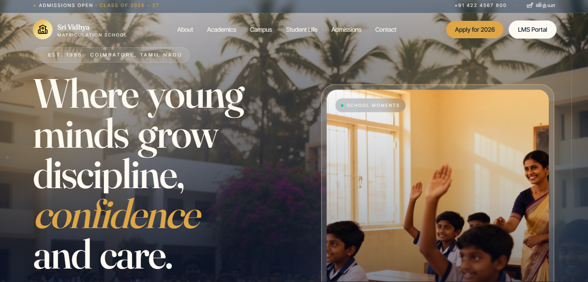| Education | B2B | 2026 | School portfolio with LMS |
| 08 | **Miox Studio** | 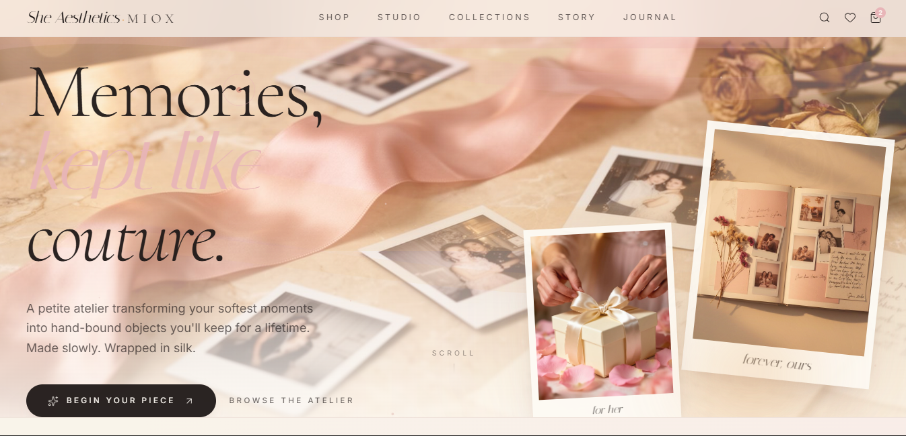| E-commerce | B2C | 2026 | Gift e-commerce boutique |
| 09 | **FinEcho** |  | Finance | B2C | 2026 | AI personal finance |
| 10 | **AgriSmart** |  | AgriTech | HW+SW | 2025 | Smart agriculture IoT |
| 11 | **Kudumba Vault** | 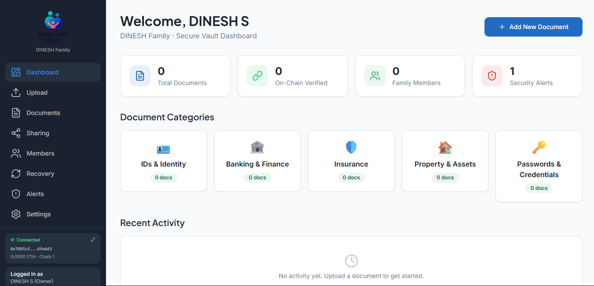 | Consumer | B2C | 2025 | Family digital vault |
| 12 | **BlockBuster** | 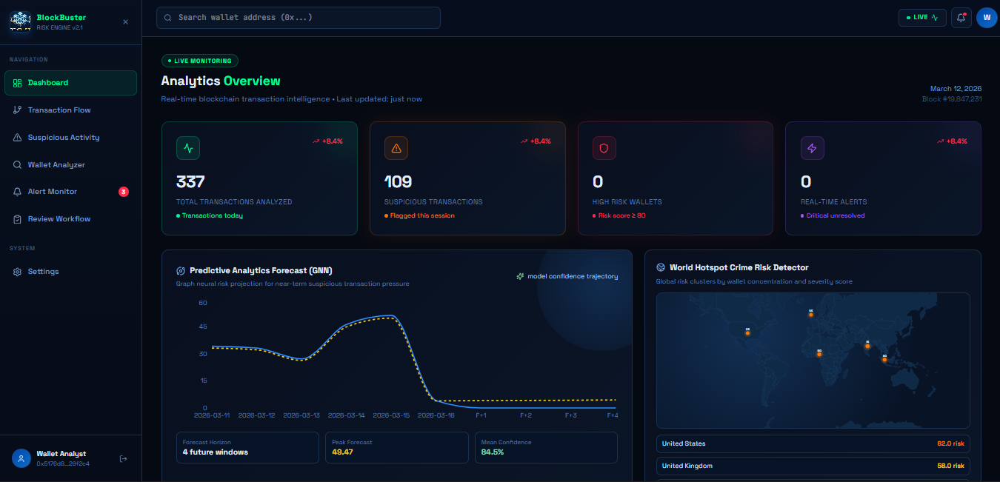 | Cybersecurity | B2B | 2025 | Blockchain security platform |
| 13 | **HealthHub** | 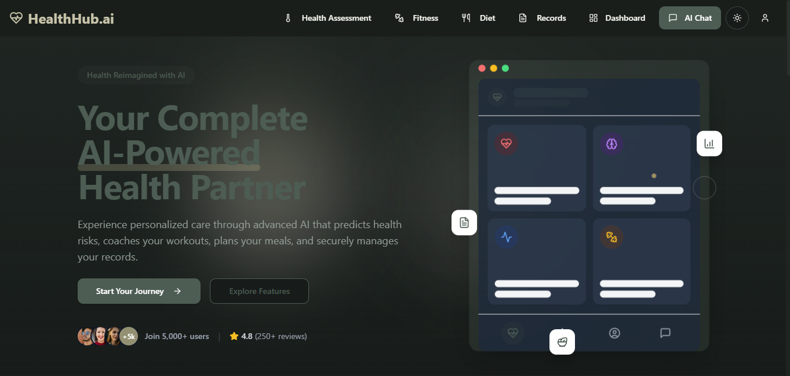 | Health | B2C | 2025 | Health monitoring platform |
| 14 | **Aerosense AI** | 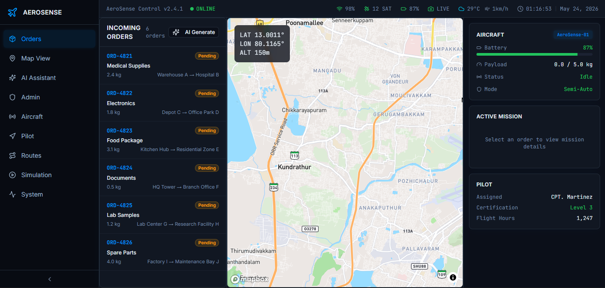 | AI / Hardware | HW+SW | 2025 | Aerial sensing & drone AI |
| 15 | **SmartBin** | 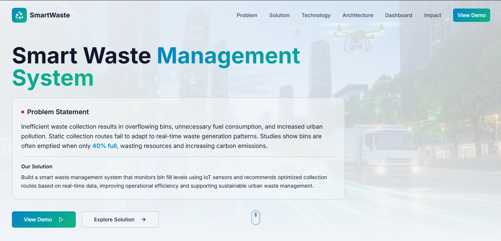 | IoT / CV | HW+SW | 2025 | CV smart waste management |
| 16 | **TamilGuard AI** | 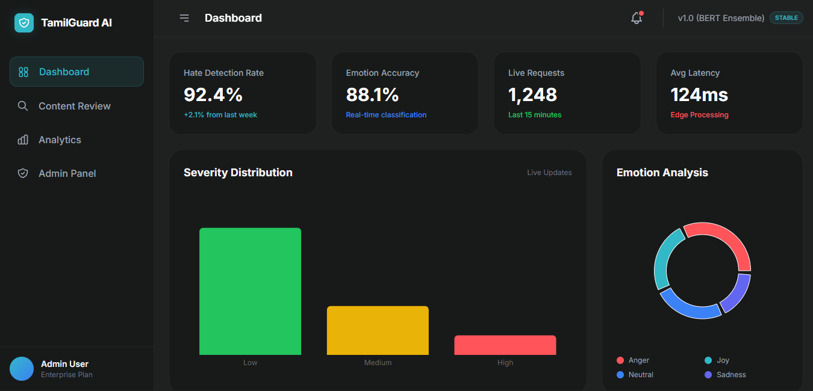 | Cybersecurity | B2B | 2025 | Regional cybersecurity AI |
| 17 | **ReportX AI** | 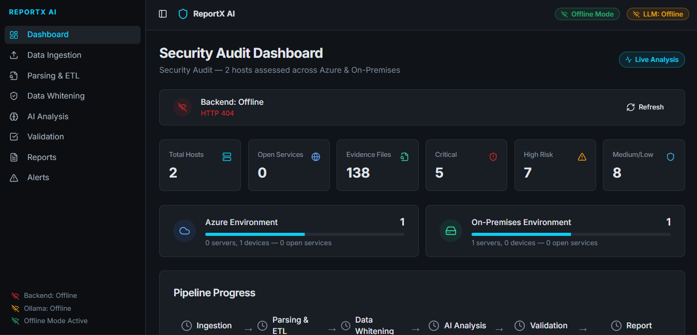 | AI & ML | B2B | 2025 | Automated report generation |
| 18 | **Red Dragon** | 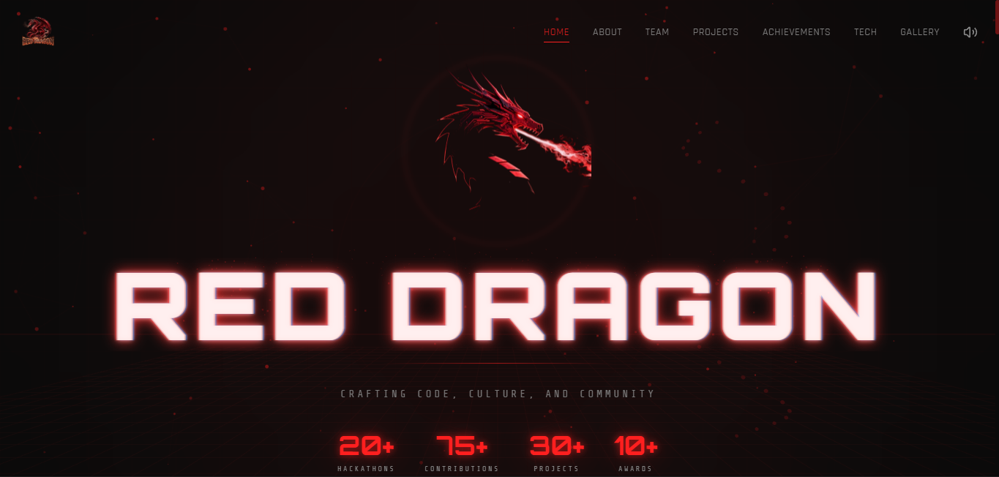 | Agentic AI | B2B | 2025 | Multi-agent enterprise AI |

### 📈 Project Distribution

```
By Category                          By Type
─────────────                        ────────
E-commerce     ███░░ 2               B2C            ████████░░ 10
SaaS           █░░░░ 1               B2B            ██████░░░░ 6
IoT / AI       ██░░░ 2               HW+SW          ████░░░░░░ 4
Brand          █░░░░ 1
Education      █░░░░ 1               By Year
Finance        █░░░░ 1               ────────
Health         █░░░░ 1               2025           ██████████ 11
Cybersecurity  ██░░░ 2               2026           ███████░░░ 7
AR / VR        █░░░░ 1
AgriTech       █░░░░ 1
Agentic AI     █░░░░ 1
Consumer       █░░░░ 1
AI & ML        █░░░░ 1
AI / Hardware  █░░░░ 1
Automation     █░░░░ 1
```

## 🧰 Tech Stack

> Every language, framework and platform powering our projects.

### Languages & Frameworks

<div align="center">

| | Technology | | Technology | | Technology |
|:---:|:---|:---:|:---|:---:|:---|
|  | **TypeScript** |  | **Python** |  | **Embedded C** |
|  | **React 19** |  | **Next.js** |  | **Node.js** |
|  | **React Native** |  | **FastAPI** |  | **Flask** |

</div>

### AI & ML

<div align="center">

| | Technology | | Technology | | Technology |
|:---:|:---|:---:|:---|:---:|:---|
|  | **LangChain** |  | **LangGraph** |  | **OpenAI / Gemini** |

</div>

### Design & Motion

<div align="center">

| | Technology | | Technology | | Technology |
|:---:|:---|:---:|:---|:---:|:---|
|  | **Tailwind CSS v4** |  | **Framer Motion** |  | **GSAP** |

</div>

### Infrastructure & DevOps

<div align="center">

| | Technology | | Technology | | Technology |
|:---:|:---|:---:|:---|:---:|:---|
|  | **Cloudflare** |  | **Vite** |  | **PostgreSQL** |
|  | **Vercel** |  | **ROS 2** |  | **Docker** |

</div>

### Full Badge Wall

<div align="center">


</div>

---

## 📈 Impact & Numbers

<div align="center">

| Metric | Value | Description |
|:---:|:---:|:---|
| 🚀 **Products Shipped** | **48+** | Launched across 12 industries |
| 🏭 **Industries** | **12** | Commerce · Media · Health · IoT · Education · Finance · AgriTech · Cybersecurity & more |
| ✅ **Uptime SLO** | **99.99%** | Enterprise-grade reliability |
| 🌐 **Active Deployments** | **128** | +12 this week |
| ⚡ **AI Inference** | **42ms** | First-token latency |
| 📊 **AI Eval Accuracy** | **98.4%** | Production-grade models |
| 🚀 **MVP to Live** | **8 weeks** | Rapid product delivery |
| 📈 **Activation Lift** | **3.2×** | Average across products |
| 🔒 **Security** | **SOC 2 Ready** | Zero-trust by default |

</div>

---

## 🗓️ Our Journey

```
┌─────────────────────────────────────────────────────────────────────────┐
│                        THENAM TIMELINE                                 │
├─────────┬───────────────────────────────────────────────────────────────┤
│  2025   │  🏗️  FOUNDED                                                │
│         │  Started in Chennai as a small studio with one belief:       │
│         │  software is becoming intelligent — let's build that future. │
├─────────┼───────────────────────────────────────────────────────────────┤
│  2025   │  🚀  FIRST PRODUCTS SHIPPED                                 │
│         │  Launched commerce, AI and IoT products. Built our internal  │
│         │  motion language and engineering platform.                   │
├─────────┼───────────────────────────────────────────────────────────────┤
│  2025   │  🧪  INNOVATION LAB                                         │
│         │  Opened the lab to invest in research that becomes shipping  │
│         │  product — vision, agents, edge AI.                         │
├─────────┼───────────────────────────────────────────────────────────────┤
│  2025   │  🎓  STUDENT ECOSYSTEM                                      │
│         │  Launched fellowships, hackathons and the residency program  │
│         │  — building the next generation of builders.                │
├─────────┼───────────────────────────────────────────────────────────────┤
│  2026   │  ⚙️  STUDIO OPERATING SYSTEM                                │
│         │  Codified our way of working — a studio OS for design,      │
│         │  engineering, AI and growth shipping together.              │
└─────────┴───────────────────────────────────────────────────────────────┘
```

---

## 🌍 Clients & Brands We've Worked With

<div align="center">

| | | | | |
|:---:|:---:|:---:|:---:|:---:|
| `Zayamazone` | `RootnSpace` | `Zara AI` | `Chennai Tales` | `TT Dry Cleaning` |
| `TastyLens` | `Vihdya School` | `Miox Studio` | `FinEcho` | `AgriSmart` |
| `Kudumba Vault` | `BlockBuster` | `HealthHub` | `Aerosense AI` | `Plan Panni Pannuvom` |
| `SmartBin` | `TamilGuard AI` | `ReportX AI` | `Red Dragon` | *& more...* |

</div>

---

## 🔗 Quick Links

<div align="center">

| Page | Link | Description |
|:---:|:---|:---|
| 🏠 | [**Homepage**](https://thenamsoftwaresolutions.com) | Studio landing page with visual storytelling |
| 🛠️ | [**Services**](https://thenamsoftwaresolutions.com/services) | All 14 service disciplines |
| 📂 | [**Projects**](https://thenamsoftwaresolutions.com/projects) | Case studies across AI, commerce, IoT & more |
| 💡 | [**Solutions**](https://thenamsoftwaresolutions.com/solutions) | Product and capability overview |
| 🧪 | [**Innovation Lab**](https://thenamsoftwaresolutions.com/innovation-lab) | Experiments and research prototypes |
| 🎮 | [**Demos**](https://thenamsoftwaresolutions.com/demos) | Live interactive product demos |
| 🎓 | [**Students**](https://thenamsoftwaresolutions.com/students) | Fellowships, mentorship & portfolios |
| 💼 | [**Careers**](https://thenamsoftwaresolutions.com/careers) | Open positions and culture |
| 🏢 | [**About**](https://thenamsoftwaresolutions.com/about) | Our story, values and team |
| ✉️ | [**Contact**](https://thenamsoftwaresolutions.com/contact) | Get in touch with us |
| 🚀 | [**Start a Project**](https://thenamsoftwaresolutions.com/start-project) | Begin your project journey |

</div>

---

## 📬 Get In Touch

<div align="center">

| Channel | Details |
|:---:|:---|
| 📱 **WhatsApp** | [+91 63804 56410](https://wa.me/916380456410) |
| 📧 **Email** | [admin@thensoftwaresolutions.com](mailto:admin@thensoftwaresolutions.com) |
| 💼 **LinkedIn** | [Thenam Software Solutions](https://www.linkedin.com/company/thenam-software-solutions/) |
| 🐙 **GitHub** | [Thenamsoftwaresolutions](https://github.com/Thenamsoftwaresolutions) |
| 🌐 **Website** | [thenamsoftwaresolutions.com](https://thenamsoftwaresolutions.com) |

</div>

<div align="center">

---

### 🚀 Ready to build something ambitious?

[](https://thenamsoftwaresolutions.com/start-project)
[](https://thenamsoftwaresolutions.com/contact)
[](https://thenamsoftwaresolutions.com/careers)

---


**© 2026 Thenam Software Solutions. All rights reserved.**

*Engineering Intelligent Digital Ecosystems.*

`AI` · `Product Engineering` · `Automation` · `Software` · `Innovation`

---

<sub>🟢 AI Concierge Online — Available for new partnerships</sub>

</div>